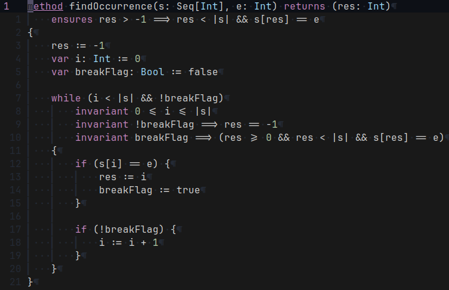

# viper.nvim

viper.nvim is a simple plugin that adds basic highlighting capabilities to NeoVim for the
verification language [Viper](https://github.com/viperproject).

Currently it uses simple parsing and word matching for this and does not use any tree structures.
